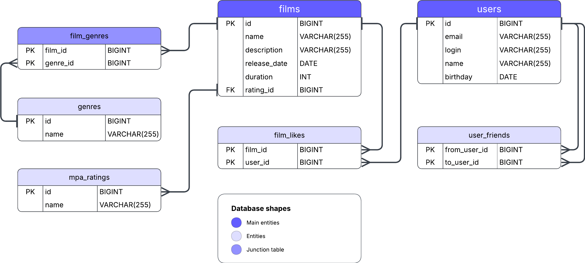

# java-filmorate




Backend-приложение для сервиса рекомендаций фильмов. Позволяет пользователям добавлять контент, ставить лайки и управлять списком друзей.

## Database Schema

Для визуализации структуры базы данных используется **DBML**. Схема ниже полностью соответствует текущей реализации в `schema.sql`.

### SQL-описание таблиц:
* **films** — информация о фильмах (связана с рейтингами MPA).
* **users** — профили пользователей.
* **mpa_ratings** — справочник возрастных рейтингов (G, PG, PG-13, R, NC-17).
* **genres** — справочник жанров фильмов.
* **film_genres** — связующая таблица для жанров фильма (Many-to-Many).
* **film_likes** — учет лайков от пользователей (Many-to-Many).
* **user_friends** — таблица связей между пользователями (Друзья).

## Примеры SQL-запросов

### Работа с фильмами
```sql
-- Получение всех фильмов с названиями их MPA рейтингов
SELECT f.*, m.name AS mpa_name
FROM films f
JOIN mpa_ratings m ON f.rating_id = m.id;

-- Получение топ-10 самых популярных фильмов по количеству лайков
SELECT f.name, COUNT(fl.user_id) AS likes_count
FROM films f
LEFT JOIN film_likes fl ON f.id = fl.film_id
GROUP BY f.id
ORDER BY likes_count DESC
LIMIT 10;
```

### Работа с пользователями и друзьями
```sql
-- Получение списка всех друзей пользователя (например, с ID = 1)
SELECT u.*
FROM users u
JOIN user_friends uf ON u.id = uf.friend_id
WHERE uf.user_id = 1;

-- Поиск общих друзей между пользователем 1 и пользователем 2
SELECT u.*
FROM users u
JOIN user_friends f1 ON u.id = f1.friend_id
JOIN user_friends f2 ON u.id = f2.friend_id
WHERE f1.user_id = 1 AND f2.user_id = 2;
```

## Тестирование и запуск

### Инициализация базы данных
При каждом запуске приложения база данных H2 инициализируется заново. Команды `DROP TABLE ... CASCADE` в `schema.sql` гарантируют, что тесты будут проходить в изолированной среде без влияния «грязных» данных от предыдущих запусков.

### Запуск тестов Postman
1. Запустите приложение в IDE или через терминал: `mvn spring-boot:run`.
2. Импортируйте коллекцию `add-database.json` в Postman.
3. Запустите Collection Runner.
4. Все тесты (41 запрос) должны иметь статус Passed.

## Технологический стек
* Java 11/17
* Spring Boot (Starter Web, Validation)
* JDBC (JdbcTemplate)
* H2 Database (Persistent storage)
* Maven
* Lombok
* Postman (API Testing)
